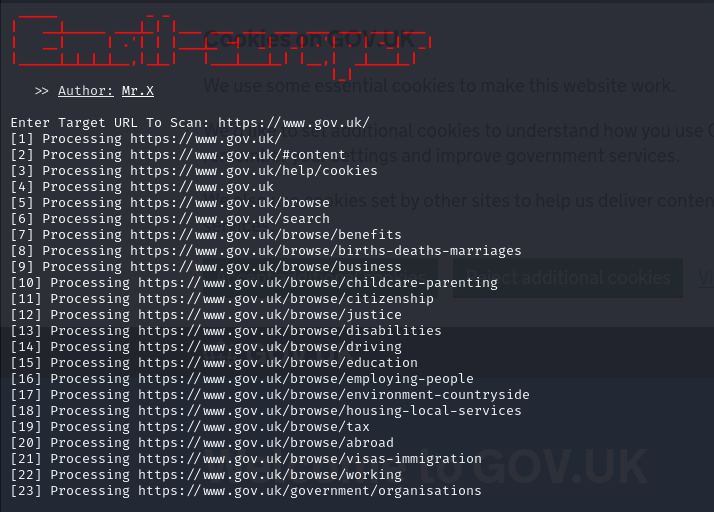

# Email-scraper


## Attention
Use this tool on Linux or other Linux-based devices, for cellphones use the Shell cloud terminal or nethunter.

## Instalations
```
$ apt-get update
$ apt-get install pip
$ pkg install git python
$ git clone https://github.com/Whomrx666/Email-scraper
$ cd Email-scraper
$ pip install -r requirements.txt
$ python3 Email-scraper.py
```

## Instructions
The way to use it is easy, namely by typing the website domain you want to go to into the tool, then the tool will automatically retrieve all emails on the website.

### Original Author
<a href="https://github.com/Whomrx666"></a>

## CONNECT WITH ME :

[](https://whomrxhackers.blogspot.com/)
[](https://twitter.com/whomrx666)
[](https://youtube.com/@whomrx666)
[](https://facebook.com/https://www.facebook.com/whomrx.666)
[](https://t.me/@Whomr_X)
[](https://wa.me/6285933663749)
[](https://www.tiktok.com/@whomr.x)

**If you want to donate, click on the button**
<a href="https://saweria.co/whomrx"></a>

### Visitors :
